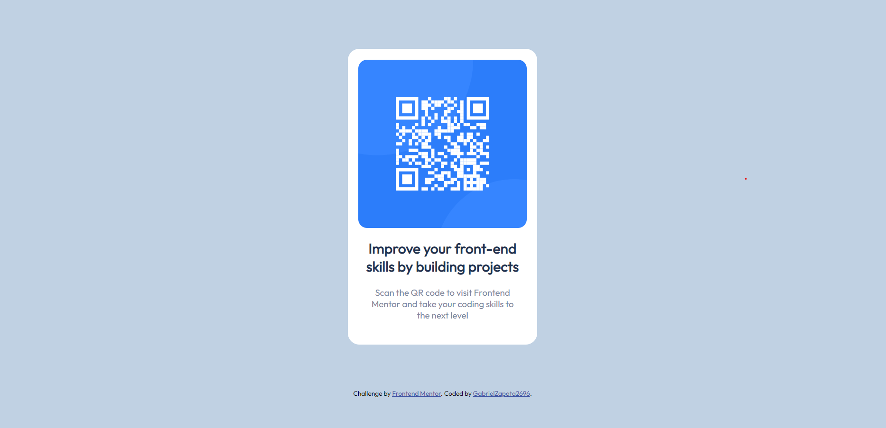

# Frontend Mentor - QR code component solution

This is a solution to the [QR code component challenge on Frontend Mentor](https://www.frontendmentor.io/challenges/qr-code-component-iux_sIO_H). Frontend Mentor challenges help you improve your coding skills by building realistic projects.

## Table of contents

- [Overview](#overview)
  - [Screenshot](#screenshot)
  - [Links](#links)
- [My process](#my-process)
  - [Built with](#built-with)
  - [What I learned](#what-i-learned)
  - [Useful resources](#useful-resources)
- [Author](#author)

## Overview

### Screenshot

Vista Desktop del desafio

### Links

- Github: [Repository] (https://github.com/GabrielZapata2696/HTML-QR-code-component-Frontend-Mentor-Challenge)
- Netlify: [Live project] (https://your-live-site-url.com)

## My process

- -Analizar el requerimiento
- -Realizar el esquema html
- -Aplicar ajustes al diseño
- -Comparar y refactorizar

### Built with

- Etiquetas HTML5
- Css Flexbox
- Conceptos Mobile-First

### What I learned

Puedo considerar que el objetivo principal es realizar la estructura html bajo el concepto mobil-first, recapitulando lo aprendido en cuanto a los estilos, en especial los de alineamiento e implementación de estilos de fuente.

### Useful resources

- [W3School](https://www.w3schools.com/cssref/pr_text_text-align.ASP) - Esta guía me ayudó a recordar el uso y semantica de la propiedad text-align para los estilos.

## Author

- Frontend Mentor - [@GabrielZapata2696](https://www.frontendmentor.io/profile/GabrielZapata2696)
